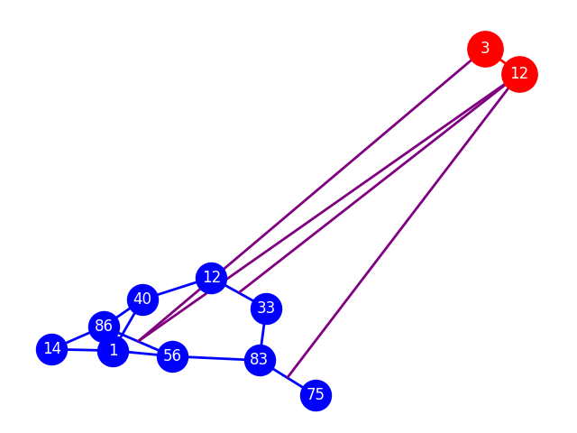

## MultiscaleRun

MultiscaleRun is an orchestrator of simulators. Currently, only Neurodamus (NEURON) and Metabolism are used together in a dual run, with more integrations planned for the future. It uses the NEURON simulator for neuronal activity, coupled with a metabolism solver.

## Testing for Development

### Prerequisites

- have an OBI spack installation working: https://github.com/openbraininstitute/spack

### Setup

You just need to run the setup script at least once before running the simulation.

#### With Spack (requires OBI spack installation):
```bash
source setup.sh
```

The script does:

- set various env variables
- create a `spackenv` folder with the necessary dependencies
- create a python virtual env in `venv` 
- call `pip install -e .` for development
- create the test folder `tiny_CI_test`
- fill it with the necessary data

If a folder is present (`spackenv`, `venv`) the script skips that installation step assuming that is already done. If any of the folders are missing, the script redoes the setup. 

The environment is still set as it is needed. 

You can always modify them and recall the setup script. It will not override your changes. 

#### Without Spack:

##### Mac:

In this case we leverage brew. First we need to install a few things:

```bash
brew install cmake openmpi hdf5-mpi python@3.12 ninja
```

We also need to link `python3`:

```bash
ln -sf /opt/homebrew/bin/python3.12 /opt/homebrew/bin/python3
```

#### Ubuntu (azure):

```bash
sudo apt-get update
sudo apt-get install -y mpich libmpich-dev libhdf5-mpich-dev hdf5-tools flex libfl-dev bison ninja-build libreadline-dev
```

#### Amazon Linux 2023 (aws):

```bash
sudo dnf update -y
sudo dnf -y install bison cpp cmake gcc-c++ flex flex-devel git python3.11-devel python3-devel python3-pip readline-devel ninja-build openmpi openmpi-devel
```

This distro does not have openmpi. We need to use the efa installer:

```bash
cd /tmp
curl -O https://efa-installer.amazonaws.com/aws-efa-installer-latest.tar.gz
tar xf aws-efa-installer-latest.tar.gz
cd aws-efa-installer
sudo ./efa_installer.sh -y --skip-kmod --mpi=openmpi5
cd -
rm -rf /tmp/aws*
```

Set python 3.11 as default (select 2):
```bash
sudo alternatives --install /usr/bin/python3 python3 /usr/bin/python3.9 1
sudo alternatives --install /usr/bin/python3 python3 /usr/bin/python3.11 2
sudo alternatives --config python3
```

This distro does not have hdf5. We install it:

```bash
export PATH=/opt/amazon/openmpi5/bin:$PATH
export LD_LIBRARY_PATH=/opt/amazon/openmpi5/lib64:$LD_LIBRARY_PATH
export CC=$(which mpicc)
export CXX=$(which mpicxx)
export MPICC=$(which mpicc)
cd /tmp
curl -O https://support.hdfgroup.org/releases/hdf5/v1_14/v1_14_6/downloads/hdf5-1.14.6.tar.gz
tar xf hdf5-1.14.6.tar.gz
cd hdf5-1.14.6
./configure --enable-parallel --enable-shared --prefix=/opt/circuit_simulation/hdf5/hdf5-1.14.6/install
make -j
sudo make install
cd
rm -rf /tmp/hdf5*
```

The rest of the installation is common for all the architectures (mac, ubuntu, alma linux). Finally, you need to run this at least once before running simulations:

```bash
source setup_no_spack.sh
```

The script does:

- set various env variables
- create a python virtual env in `venv` with neuron and neurodamus
- build `libsonatareport`
- build the correct `neurodamus-models`
- call `pip install -e .` for development

If a folder is present (`libsonatareport`, `neurodamus-models`, `venv`) the script skips that installation step assuming that is already done. If any of the folders are missing, the script redoes the setup. 

The environment is still set as it is needed. 

You can always modify them and recall the setup script. It will not override your changes. 

### Unit Tests

Just run with pytest:

```bash
pytest tests/unit
```

### Formatting

Use ruff:

```bash
ruff check --fix
```

### Integration Test

To explore the integration tests, we recommend starting with `mini_tiny_CI`. This is a small toy circuit containing 2 astrocytes and 9 neurons. It was specifically chosen because it exercises all the capabilities of MultiscaleRun while remaining simple enough for thorough inspection.

The setup includes 2 astrocytes connected to several neuron-to-neuron edges, with one neuron-to-neuron edge linked to both astrocytes. This circuit was extracted from the `tiny_CI` circuit, which itself was derived from a rat circuit. The exact source circuit was lost during the migration from BBP to OBI. The full connection diagram is shown below:



To run the test, first execute `setup.sh` or `setup_no_spack.sh`, then, from the base repository folder:

```bash
mkdir mini_tiny_CI_test
cd mini_tiny_CI_test
multiscale-run init . --circuit=mini_tiny_CI
source ../.ci/setup.sh
download_mini_tiny_CI_circuit
mpirun -n 2 multiscale-run compute
```

#### Note

At the moment this simulation depleates atpi and fails after 300 ms. TODO: fix it.

#### Postprocessing

After the simulation has completed you can check the results with the postproc jupyter notebook. It is already in the current folder. Just run jupyter:

```bash
jupyter lab
```

open `postproc.ipynb` and run. By default it presents all the traces for the gids `[0, 1, 2]`. The notebook should be self-explainatory and can be changed at will. 

### Docs

Build the documentation locally with:

```bash
sphinx-build -W --keep-going docs docs/build/html
```

Alternatively, check the official documentation at: https://multiscalerun.readthedocs.io/stable/

### Azure

To run on Azure, request a VM from Erik. Once you have the credentials:

1. SSH into the VM.
2. Install the dependencies by following the [Setup](#setup) section (Linux).
3. Run the simulation.
4. Start post-processing on the VM:
   ```bash
   jupyter lab --no-browser --port=8888
   ```
   In parallel, on your local machine, create an SSH tunnel:
   ```bash
   ssh -L 8888:localhost:8888 <user>@<remote-host>
   ```
   Then open Jupyter in your local browser at http://localhost:8888

## Authors

Polina Shichkova, Alessandro Cattabiani, Christos Kotsalos, and Tristan Carel

## Acknowledgment

The development of this software was supported by funding to the Blue Brain Project,
a research center of the École polytechnique fédérale de Lausanne (EPFL),
from the Swiss government's ETH Board of the Swiss Federal Institutes of Technology.

Copyright (c) 2005-2023 Blue Brain Project/EPFL
Copyright (c) 2025 Open Brain Institute