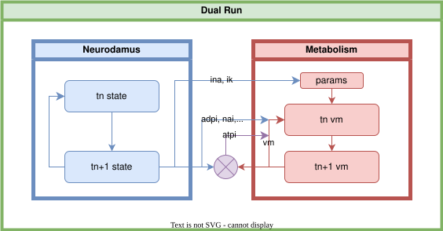

.. MultiscaleRun documentation master file, created by
   sphinx-quickstart on Wed Feb 21 15:03:51 2024.
   You can adapt this file completely to your liking, but it should at least
   contain the root `toctree` directive.

.. mdinclude:: ../README.md

Python API Reference
--------------------
You can find below the internal documentation of the ``multiscale_run`` Python package:

.. toctree::
   :maxdepth: 2

   Python API Reference <modules>

   simulation_config

   contributing
